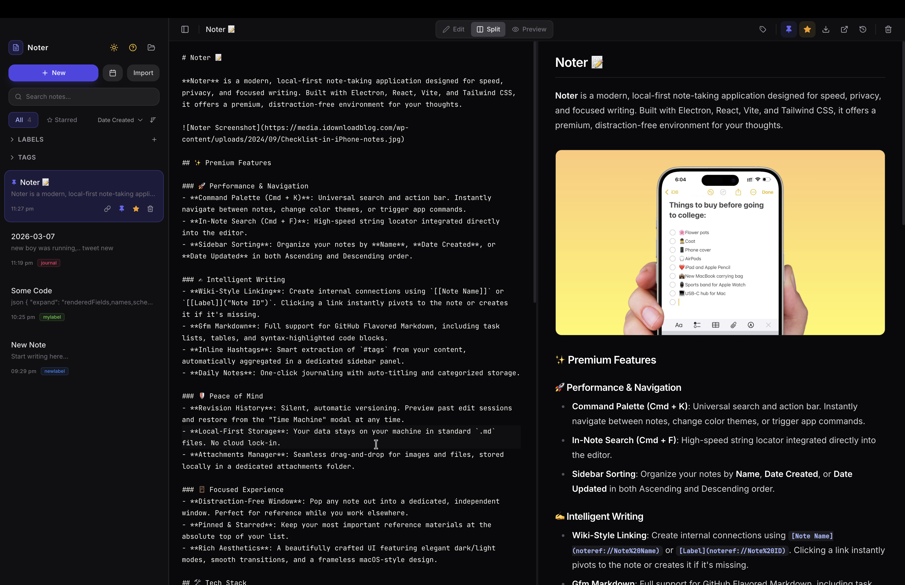

# Noter 📝

**Noter** is a modern, local-first note-taking application designed for speed, privacy, and focused writing. Built with Electron, React, Vite, and Tailwind CSS, it offers a premium, distraction-free environment for your thoughts.



## ✨ Premium Features

### 🚀 Performance & Navigation
- **Command Palette (Cmd + K)**: Universal search and action bar. Instantly navigate between notes, change color themes, or trigger app commands.
- **In-Note Search (Cmd + F)**: High-speed string locator integrated directly into the editor.
- **Sidebar Sorting**: Organize your notes by **Name**, **Date Created**, or **Date Updated** in both Ascending and Descending order.

### ✍️ Intelligent Writing
- **Wiki-Style Linking**: Create internal connections using `[[Note Name]]` or `[[Label]]("Note ID")`. Clicking a link instantly pivots to the note or creates it if it's missing.
- **Gfm Markdown**: Full support for GitHub Flavored Markdown, including task lists, tables, and syntax-highlighted code blocks.
- **Inline Hashtags**: Smart extraction of `#tags` from your content, automatically aggregated in a dedicated sidebar panel.
- **Daily Notes**: One-click journaling with auto-titling and categorized storage.

### 🛡️ Peace of Mind
- **Revision History**: Silent, automatic versioning. Preview past edit sessions and restore from the "Time Machine" modal at any time.
- **Local-First Storage**: Your data stays on your machine in standard `.md` files. No cloud lock-in.
- **Attachments Manager**: Seamless drag-and-drop for images and files, stored locally in a dedicated attachments folder.

### 🪟 Focused Experience
- **Distraction-Free Window**: Pop any note out into a dedicated, independent window. Perfect for reference while you work elsewhere.
- **Pinned & Starred**: Keep your most important reference materials at the absolute top of your list.
- **Rich Aesthetics**: A beautifully crafted UI featuring elegant dark/light modes, smooth transitions, and a frameless macOS-style design.

## 🛠️ Tech Stack

- **Runtime**: [Electron](https://www.electronjs.org/)
- **Frontend**: [React 18](https://reactjs.org/) + [Vite](https://vitejs.dev/)
- **Architecture**: [Bun](https://bun.sh/) managed local-first filesystem
- **Styling**: [Tailwind CSS 3](https://tailwindcss.com/)
- **Editor**: [CodeMirror 6](https://codemirror.net/) with custom extensions
- **Icons**: [Lucide React](https://lucide.dev/)

## 🚀 Getting Started

### Installation

1. **Clone the repository**
   ```bash
   git clone https://github.com/SudhansuuRanjan/noter.git
   cd noter
   ```

2. **Install dependencies**
   ```bash
   bun install
   ```
   *(or `npm install`)*

3. **Development**
   ```bash
   bun run dev
   ```

### Building for Production

To create a distributable application:
```bash
bun run build
```
Binaries will be generated in the `release/` directory.

## 📂 Project Structure

- `electron/` — Main process logic, IPC handlers, and filesystem bridge.
- `src/` — Renderer process (React application).
  - `context/` — Centralized state management for notes and app settings.
  - `components/` — Modular UI components (Editor, Preview, Sidebar, Modals).
  - `styles/` — Global design tokens and Tailwind configuration.

## ⚖️ License

Distributed under the MIT License. See `LICENSE` for more information.
