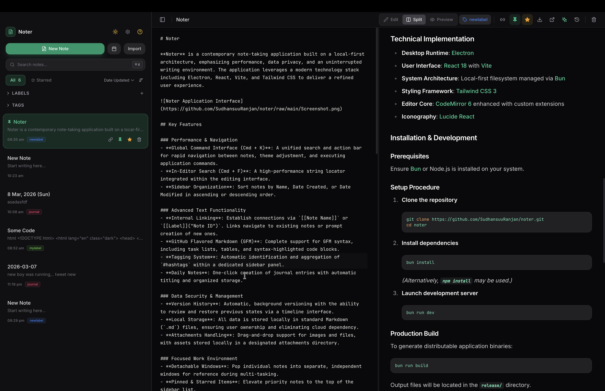

# Noter 📝

**Noter** is a modern, local-first note-taking application designed for speed, privacy, and focused writing. Built with Electron, React, Vite, and Tailwind CSS, it offers a premium, distraction-free environment for your thoughts.



## ✨ Premium Features

### 🤖 Intelligence & Writing
- **AI Writer & Editor**: Integrated writing assistant for rephrasing, summarizing, grammar correction, and content expansion. Powered by context-aware LLM flows.
- **Advanced Markdown**: Native support for **Mermaid Diagrams** (charts, flows), **LaTeX Math** (inline and block formulas), and enhanced **Interactive Tables**.
- **In-Note Search (Cmd + F)**: High-speed string locator integrated directly into the editor.
- **Code Copy**: Hover-activated copy buttons on all code blocks with clean AST-based string extraction.

### 🚀 Navigation & Portability
- **Command Palette (Cmd + K)**: Universal search and action bar. Instantly navigate between notes, change color themes, or trigger app commands.
- **Smart Note Links**: Connect thoughts with Wiki-Style \`[[Note Links]]\`. Features a smart router to open links in the current view or a **Dedicated New Window**.
- **Daily Notes**: One-click journaling with auto-titling (e.g., "12 Mar, 2025 (Mon)").
- **Professional PDF Export**: One-click native PDF generation with optimized print typography and isolated styling.

### 🎨 Personalization & UI
- **Dynamic Accent Themes**: Choose between **Indigo**, **Cyan**, or **Pink** themes that instantly rebind the entire app's color palette.
- **Glassmorphism & UX**: A beautifully crafted UI featuring elegant dark/light modes, backdrop blurs, and smooth frameless transitions.
- **Sidebar Organization**: Smart sorting by Name/Date, inline hashtag extraction, and customizable file labels.

### 🛡️ Built for Professionals
- **Revision History**: Silent, automatic versioning. Preview past edit sessions and restore from the "Time Machine" modal.
- **Local-First**: Standard \`.md\` file storage. Your data never leaves your machine.
- **Attachments Manager**: Secure local images and file storage with drag-and-drop integration.

## 🛠️ Tech Stack

- **Runtime**: [Electron](https://www.electronjs.org/)
- **Frontend**: [React 18](https://reactjs.org/) + [Vite](https://vitejs.dev/)
- **Architecture**: [Bun](https://bun.sh/) managed local-first filesystem
- **Styling**: [Tailwind CSS 3](https://tailwindcss.com/)
- **Editor**: [CodeMirror 6](https://codemirror.net/) with custom extensions
- **Icons**: [Lucide React](https://lucide.dev/)

## 🚀 Getting Started

### Installation

1. **Clone the repository**
   ```bash
   git clone https://github.com/SudhansuuRanjan/noter.git
   cd noter
   ```

2. **Install dependencies**
   ```bash
   bun install
   ```
   *(or `npm install`)*

3. **Development**
   ```bash
   bun run dev
   ```

### Building for Production

To create a distributable application:
```bash
bun run build
```
Binaries will be generated in the `release/` directory.

## 📂 Project Structure

- `electron/` — Main process logic, IPC handlers, and filesystem bridge.
- `src/` — Renderer process (React application).
  - `context/` — Centralized state management for notes and app settings.
  - `components/` — Modular UI components (Editor, Preview, Sidebar, Modals).
  - `styles/` — Global design tokens and Tailwind configuration.

## ⚖️ License

Distributed under the MIT License. See `LICENSE` for more information.
